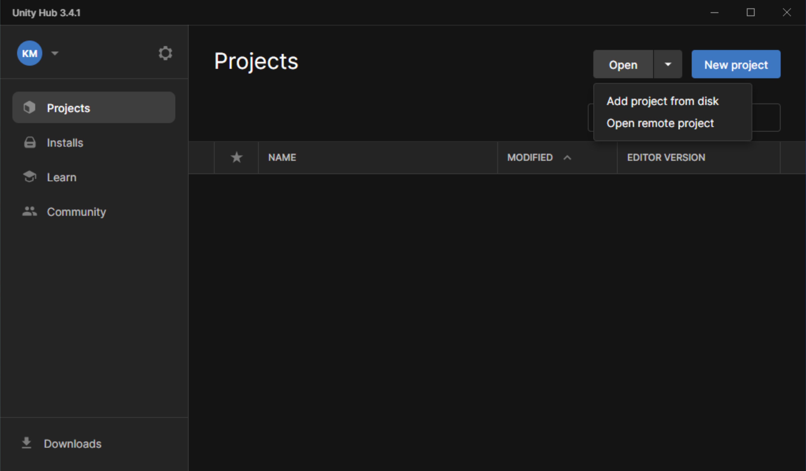

# Welcome to the Video Game named Videogame2D 🎮🕹
A video game created and programmed with different functionalities, in which a character with different skins is presented, which must collect different fruits avoiding the enemies which have random movements

# Project features 🚨:
  *** Unity version: 2021.3.18f1***  
  ***UnityHub version: 3.4.1***  
  ***Android Studio version: 4.0***  
  
  ## ***ScreenShoot: 🎮🕹***  
   |  |  |  
|---|---|---|

|  |  |  
|---|---|---|

# Steps to run the project 🚨:

> 1.- Once the project is downloaded, you must have the three fundamental programs installed such as ***UnityHub***, ***Unity*** and ***Android Studio***. Preferably the previously commented versions in this same document.

> 2.- Once we have downloaded the programs, we proceed to configure the Android Studio program, we go to Configure and then to SDK Manager.
>> NOTE: In this link you can find a step by step to download and install Android Studio. [Link](https://docs.unrealengine.com/5.0/en-US/how-to-set-up-android-sdk-and-ndk-for-your-unreal-engine-development-environment/)

   

> 3.- We proceed to configure the SDK Platforms and SDK Tools sections taking into account the versions of each installed element (to see the versions check the Show Package Details box)

 References of the different versions of the different plugins or elements 

 
 |  
|---|

|  
|---|

|  
|---|

|  
|---|

|  
|---|

|  
|---|

> 4.- Once you have everything configured, proceed to open the UnityHub program, and then go to the Open button and choose the Add Project from disk option; find the location of the previously downloaded file.

 ## More info about me: 

Ing. Kevin J. Montero Zea 

CE: 004712881 🆔

+51-913-695-382 📱

<a href="https://www.linkedin.com/in/kevin913montero/">
    LinkedIn 👨‍🦰
  </a>

<a href="https://portfoliokjmz.netlify.app/">
    Portfolio 💼
  </a>

 

